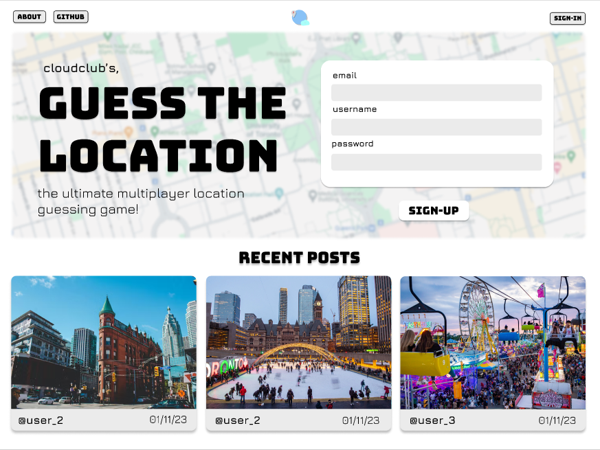
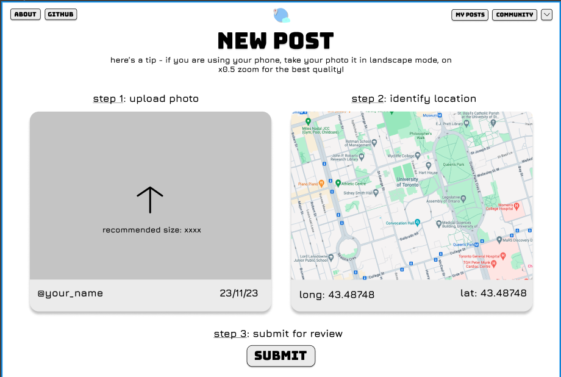
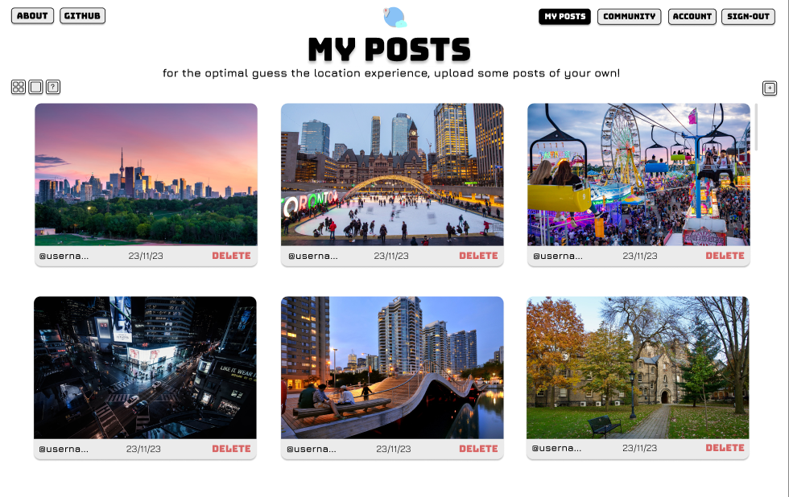
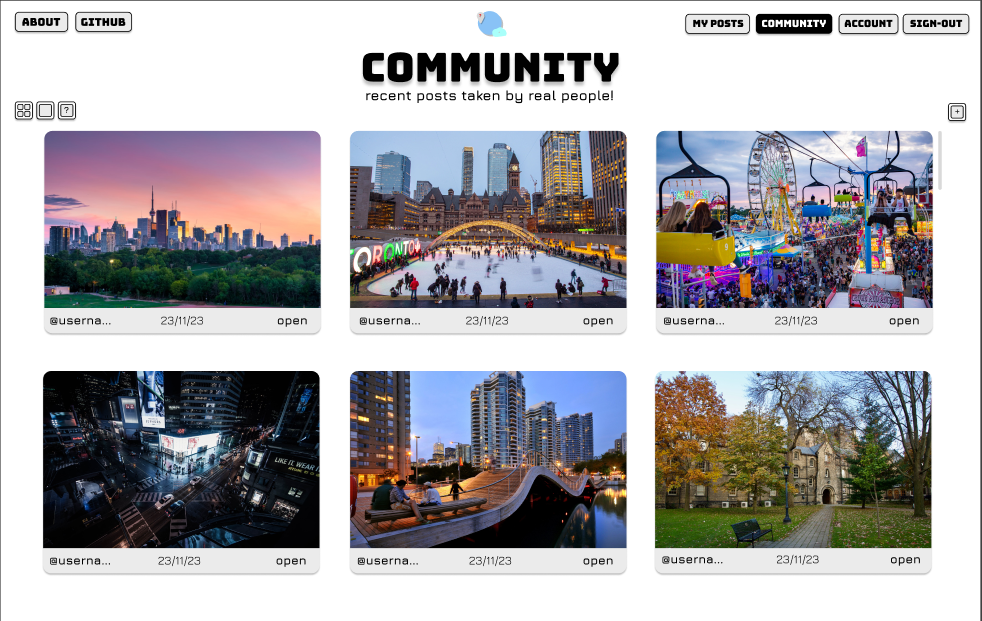
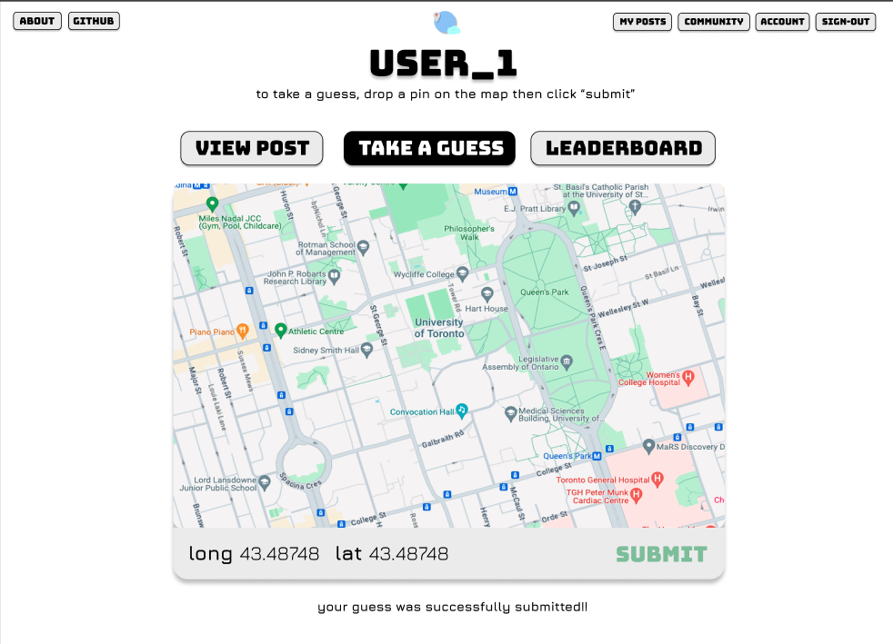
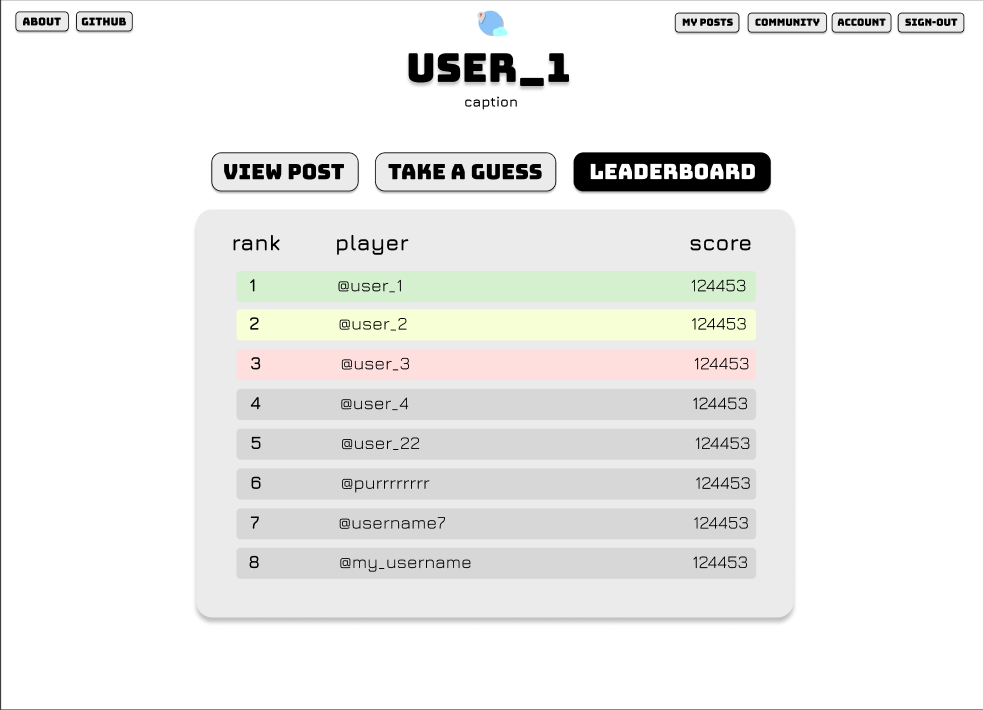

# GuessTheLocation

## Our Website
### "Guess My Location" is a web-based interactive online game that allows users to upload pictures of various locations.

### Once you create an account, you are able to post pictures and participate in the guessing process. 

### You will be able to share your post through our embedded Google Maps.

### In addition, you can easily track and delete your posts if needed through the "My Posts" page.

### You can also view other people's posts and participate in guessing their location through an interactive Google Maps.

### A leaderboard is also available for ranking among players.

## Local Development
1. Clone this repository
2. `cd GuessTheLocation`
3. `cd server && npm i` to install dependencies for the server directory
   1. Note: npx db-migrate up --config database/database.json to set up database
4. `npm run dev`. You should get message `Server listening on 3001`
5. Open a new terminal and run `cd GuessTheLocation/client`
6. Run `npm i` to install dependencies for the client directory
7. `npm start`
8. Navigate to `localhost:3000`, you should see "Hello from server!" message displayed
   1. Note: you should also see the message when navigating to `localhost:3001/api`

## Making Changes
1. Always create a new branch
2. Start both the client and server (see instructions above)
3. Simply save your changes and see them displayed on localhost:3000
